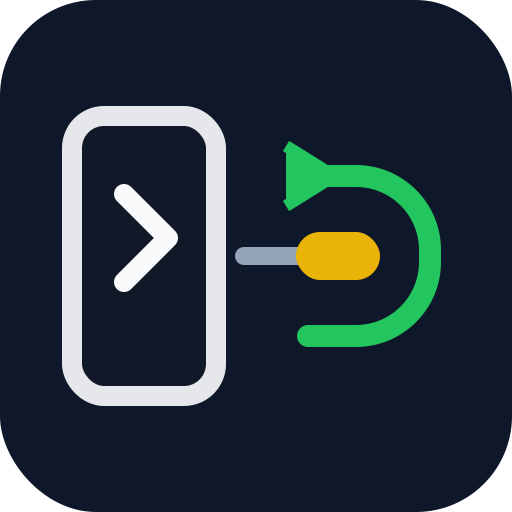

# copilot-acp-mcp-bridge

<p align="center">
  
</p>

[](https://nodejs.org/)
[](./LICENSE)
[](https://modelcontextprotocol.io/)
[](https://docs.github.com/copilot/how-tos/copilot-cli)

Run GitHub Copilot CLI behind a local MCP server.

If your client speaks MCP and Copilot speaks ACP, this bridge sits in the middle and gets out of the way.

> **Status:** Copilot CLI ACP is in public preview. The protocol surface may change. Pin your Copilot CLI version and test after upgrades.

```text
Codex / Claude Code / MCP client
            ↓
     copilot-acp-mcp-bridge
            ↓
   copilot --acp --stdio
```

Example:

```bash
codex mcp add copilot -- node /absolute/path/to/copilot-acp-mcp-bridge.js
```

## quickstart

```bash
git clone https://github.com/oijkn/copilot-acp-mcp-bridge.git
cd copilot-acp-mcp-bridge
codex mcp add copilot -- node /absolute/path/to/copilot-acp-mcp-bridge.js
```

If you want to call it by command name instead of path:

```bash
npm link
codex mcp add copilot -- copilot-acp-mcp-bridge
```

If you want to pin a default model for the whole bridge process:

```bash
COPILOT_ARGS_JSON='["--model","gpt-5.2"]' \
codex mcp add copilot -- node /absolute/path/to/copilot-acp-mcp-bridge.js
```

If you need a specific working directory:

```bash
COPILOT_ACP_BRIDGE_CWD=/home/you/project \
codex mcp add copilot -- node /absolute/path/to/copilot-acp-mcp-bridge.js
```

With the linked CLI:

```bash
COPILOT_ACP_BRIDGE_CWD=/home/you/project \
codex mcp add copilot -- copilot-acp-mcp-bridge
```

## why this exists

GitHub Copilot CLI already speaks ACP. MCP clients speak MCP. Those two pieces do not talk to each other directly.

This repo fills that gap. It turns MCP `tools/call` requests into ACP `session/prompt` calls and sends the result back over stdio. If you want to use Copilot from an MCP client without writing your own adapter first, this is the missing piece.

## what you get

- One local stdio bridge, no npm install step
- Persistent sessions for conversational use
- Fresh one-shot sessions with `freshSession: true`
- A hard tool block with `allowTools: false`
- Basic diagnostics through `copilot_session_status` and `copilot_reset_session`

## how it works

```
MCP client (Codex, etc.)
  └── MCP stdio ──> copilot-acp-mcp-bridge
                      └── ACP stdio ──> copilot --acp --stdio
                                          └── Copilot's own MCP servers
                                              (Docker, GitHub, AWS, Playwright, ...)
```

The bridge translates `tools/call ask_copilot` (MCP) into `session/prompt` (ACP) and streams updates back. Copilot loads its own MCP config automatically in ACP mode, so its full toolset is available without extra configuration.

## requirements

- Node.js >= 18
- GitHub Copilot CLI >= 1.0.9, authenticated (`copilot login`)
- An MCP client that can run a local stdio server (`codex mcp add`, Claude Code, etc.)

No npm dependencies. The bridge uses only Node.js built-ins.

## tools

### `ask_copilot`

Send a task to Copilot. Returns Copilot's response plus a telemetry block (tool calls, plan, usage) when `INCLUDE_TELEMETRY_IN_OUTPUT=true` (default).

| Argument | Type | Default | Description |
|---|---|---|---|
| `prompt` | string | required | Task or question for Copilot |
| `context` | string | — | System or background text prepended to the prompt |
| `freshSession` | boolean | `false` | Spawn a fresh Copilot process for this call only |
| `allowTools` | boolean | `true` | If `false`, hard-block all tool use: every ACP `session/request_permission` is answered with `cancelled`, regardless of `permissionPolicy` |
| `model` | string | — | Optional Copilot CLI model name. Applies at the process/session level, not as an ACP per-prompt switch |

Unknown arguments are rejected with MCP error `-32602`. There is no silent fallback.

Model semantics:

- `model` configures the Copilot process used for the call or session
- `freshSession: true` + `model` starts a disposable Copilot process with `--model <name>`
- the first persistent call may also set `model`; that choice is then fixed until `copilot_reset_session`
- a later persistent call that requests a different model is rejected with `-32602`
- the bridge does not claim to know the effective backend model unless Copilot ACP exposes it directly

Session modes:

- **Persistent (default):** One Copilot process, one ACP session, reused across calls. Copilot retains context between prompts. Calls are serialized.
- **Fresh (`freshSession: true`):** A new Copilot process is spawned for the call and killed when it completes. No context from previous calls. Use for isolated analysis, one-shot tasks, or anything where a clean slate matters.

### `copilot_session_status`

Returns the current state of the persistent session: `sessionId`, `sessionAgeMs`, `promptCount`, `agentInfo`, `persistentConfiguredModel`, `modelSource`, `activePrompt`.

### `copilot_reset_session`

Kills the persistent Copilot process and resets the session. The next `ask_copilot` call starts fresh.

| Argument | Type | Description |
|---|---|---|
| `reason` | string | Optional log note |

## environment variables

| Variable | Default | Description |
|---|---|---|
| `COPILOT_BIN` | `copilot` | Path to the Copilot CLI binary |
| `COPILOT_ARGS_JSON` | `[]` | Extra args to pass to `copilot --acp --stdio` as JSON array |
| `COPILOT_ACP_BRIDGE_CWD` | `process.cwd()` | Working directory for the ACP session |
| `CHAIRMAN_CWD` | — | Legacy alias for `COPILOT_ACP_BRIDGE_CWD` |
| `STARTUP_TIMEOUT_MS` | `15000` | Timeout for ACP handshake |
| `PROMPT_TIMEOUT_MS` | `300000` | Timeout for a single prompt |
| `CANCEL_GRACE_MS` | `10000` | Grace period after `session/cancel` |
| `PERMISSION_POLICY` | `first` | `first`, `prefer-allow`, or `cancel` |
| `PREFERRED_PERMISSION_OPTION_ID` | — | Auto-select a specific permission option by ID |
| `AUTO_AUTH_METHOD_ID` | — | Attempt ACP auth automatically if Copilot requires it |
| `EAGER_START` | `false` | Start Copilot immediately on bridge startup instead of on first call |
| `INCLUDE_TELEMETRY_IN_OUTPUT` | `true` | Append tool calls, plan, and session metadata to MCP response |
| `INCLUDE_USAGE_IN_OUTPUT` | `true` | Include token usage in telemetry block |
| `LOG_LEVEL` | `info` | `error`, `warn`, `info`, `debug` |
| `ACP_SESSION_CONFIG_OPTIONS_JSON` | — | Extra config options passed to `session/new` |
| `ACP_SESSION_MODES_JSON` | — | Session modes passed to `session/new` |
| `COPILOT_ACP_MCP_SERVERS_JSON` | — | MCP servers to inject into `session/new` (JSON array) |
| `COPILOT_ACP_MCP_SERVERS_FILE` | — | Path to a JSON file with MCP server list |

`COPILOT_ARGS_JSON` can already pin a process-wide model, for example `["--model","gpt-5.2"]`.

## running the tests

```bash
# Unit tests (no Copilot required)
BRIDGE=./copilot-acp-mcp-bridge.js bash test-bridge.sh unit

# Full test suite (requires authenticated Copilot CLI)
BRIDGE=./copilot-acp-mcp-bridge.js \
COPILOT_ACP_BRIDGE_CWD=/your/project \
bash test-bridge.sh
```

If you linked the package locally, this works too:

```bash
npm run test:unit
```

## known limitations

- ACP session `cwd` is fixed at `session/new`. There is no per-call working directory override. Multi-repo use requires restarting the bridge or calling `copilot_reset_session`.
- `allowTools: false` blocks permissions at the bridge level, but cannot prevent Copilot from reasoning about tools internally. It is a protocol-level guard, not a model-level constraint.
- On prompt timeout, the bridge sends ACP `session/cancel` to Copilot, then surfaces the timeout back to the MCP client as an error.
- Copilot CLI ACP is in public preview. Pin your CLI version (`copilot --version`) and check the [Copilot CLI docs](https://docs.github.com/copilot/how-tos/copilot-cli) after upgrades.
- Multi-session (one session per repo or per call) is not implemented. All persistent calls share one session.
- `model` is implemented with process/session-level semantics. The bridge does not do per-prompt model switching inside an already running persistent ACP session.

## tested environment

| Component | Version |
|---|---|
| Node.js | 22.x |
| Copilot CLI | 1.0.9 |
| MCP protocol | 2024-11-05 |
| ACP protocol | 1 |

## repository metadata

GitHub description:
`Run GitHub Copilot CLI behind a local MCP server through ACP.`

Suggested topics:
`mcp`, `model-context-protocol`, `acp`, `agent-client-protocol`, `github-copilot`, `copilot-cli`, `nodejs`, `stdio`

Suggested social preview:
- use `docs/logo.svg` on a dark background
- subtitle: `MCP bridge for GitHub Copilot CLI`

## license

Apache-2.0 — see [LICENSE](LICENSE).
